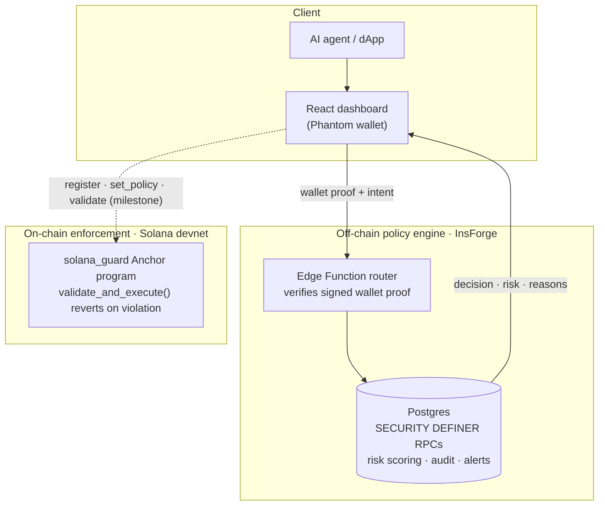
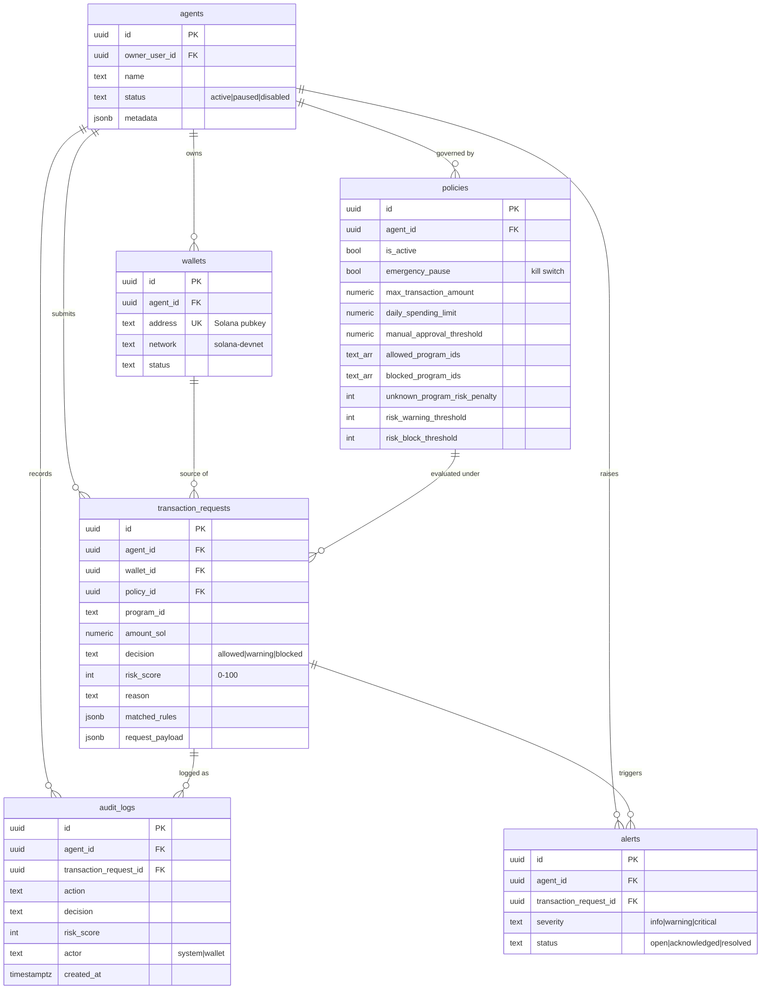

<div align="center">

# SolanaGuard

**A policy firewall for AI agents that hold Solana wallets.**

Give an autonomous agent a wallet and it can move funds at machine speed — including straight into a drain. SolanaGuard sits between the agent and the chain: every transaction intent is checked against an owner-defined policy *before* it executes, scored for risk, logged immutably, and killable in one click.

[**▶ Live demo**](https://solanaguard.app) · [**On-chain program (devnet)**](https://explorer.solana.com/address/EdskrgG3PmMPxzaNuvp7oJjZ5MU3jkXmY4bHbSYpnsWF?cluster=devnet) · [**Quickstart for testers**](#-quickstart-for-testers)

`devnet` · `not audited` · `MVP — see status`

</div>

---

## What it does

An owner registers an **agent**, attaches a **risk policy** (per-transaction limit, daily limit, manual-approval threshold, program allow/block lists), and from then on every action the agent proposes is evaluated:

| Decision | Meaning | Example |
|---|---|---|
| 🟢 `allowed` | Within every policy limit | Known program, small transfer |
| 🟡 `warning` | Permitted but flagged | Above the manual-approval threshold |
| 🔴 `blocked` | Rejected outright | Blocked program, over a limit, or kill switch on |

Every decision returns a **risk score (0–100)**, the **policy rules that matched**, and a written **reason** — and is written to an append-only audit log. A one-click **emergency pause** (kill switch) blocks 100% of an agent's actions instantly.

SolanaGuard enforces this on **two independent layers**:

| Layer | Where | What it guarantees | Status |
|---|---|---|---|
| **Policy engine** | Off-chain — InsForge (Postgres + Edge Functions) | Fast risk scoring, audit trail, alerts, dashboard | ✅ Live |
| **On-chain enforcement** | Solana devnet — Anchor program | A violating transaction *reverts on-chain* — the agent literally cannot execute it | ✅ Deployed (devnet) |

> The two layers share the same policy shape. The off-chain engine is the live decision layer today; the on-chain program proves the same rules can be enforced trustlessly. Moving funds via CPI based on the on-chain decision is the next milestone (see [Roadmap](#-status--roadmap)).

---

## 🏗️ Architecture



**Off-chain request path:** the browser signs an ed25519 *wallet proof* → the InsForge Edge Function router verifies it (address, timestamp, 5-minute TTL) → it calls a `SECURITY DEFINER` Postgres RPC through the privileged `project_admin` route → the RPC scores risk, persists the request, writes an audit log, and raises an alert. No API keys ever touch the browser; direct RPC access for wallet-scoped functions is revoked from `PUBLIC`, `anon`, and `authenticated`.

---

## 🚀 Quickstart for testers

**No setup required.** Open the hosted demo and walk the flow — it talks to the live InsForge backend.

> 🔗 **[solanaguard.app](https://solanaguard.app)** — needs the [Phantom](https://phantom.app) browser extension on **devnet**. No real funds are moved; the wallet is used only to sign a proof-of-ownership message.

1. **Connect** your Phantom wallet.
2. **Sign** the wallet-proof message when prompted (this authorizes wallet-scoped calls).
3. **Seed demo data** — creates a demo agent, wallet, and policy.
4. **Create an agent** from the Agent Registry.
5. **Create a policy** from the Policy Builder.
6. **Run the transaction presets** — `safe`, `warning`, and `blocked` — and watch the decision, risk score, and matched rules update live.
7. **Review** real transaction history and the audit log (served from the backend, not mocked).
8. **Flip the kill switch** (emergency pause).
9. Re-run the **safe** preset → it now returns `blocked` with risk score `100`.
10. **Disable** the kill switch and confirm the safe preset is `allowed` again.

That round trip exercises the whole system: signed auth → policy evaluation → persistence → audit → kill switch → recovery.

---

## 🧪 Run it locally

```bash
cd app
npm install

# Point the app at the live InsForge function host
printf 'VITE_INSFORGE_FUNCTIONS_URL=https://mhzv65qi.ap-southeast.insforge.app/functions\n' > .env

npm run dev      # → http://127.0.0.1:5173
```

```bash
npm run build    # production build (tsc + vite)
```

**Stack:** React 18 · Vite · TypeScript · Tailwind · `@solana/wallet-adapter` (Phantom) · `@coral-xyz/anchor`.

> ⚠️ The deployable dApp lives in **`app/`**. The root `src/` directory is an earlier landing-page prototype and is **not** the demo. `.env`, `.env.local`, `.insforge`, `node_modules`, `dist`, and `.devnet/` are gitignored.

---

## 🗄️ Schema design

SolanaGuard's data model is the product. It exists in two mirrored forms — a rich relational model off-chain, and a minimal account model on-chain — sharing one conceptual shape: **owner → agent → policy → decisions**.

### Off-chain data model (Postgres / InsForge)



| Table | Purpose | Key design choices |
|---|---|---|
| **`agents`** | The autonomous actor under protection | `owner_user_id` ties an agent to its human owner; `status` gates all actions (a non-active agent is auto-blocked) |
| **`wallets`** | Solana addresses an agent controls | `address` is `UNIQUE`; the signed wallet proof must match a row here to authorize scoped calls |
| **`policies`** | The risk rules | Versioned: creating a new policy deactivates the old one, so history is preserved. `emergency_pause` is the kill switch |
| **`transaction_requests`** | Every evaluated intent + its verdict | Stores `decision`, `risk_score`, `matched_rules`, and the raw `request_payload` for full replay |
| **`audit_logs`** | Append-only trail | Insert-only (no `UPDATE`/`DELETE` grant to clients); `actor` distinguishes `system` vs `wallet`-initiated actions |
| **`alerts`** | Operator surface for warnings/blocks | `severity` escalates to `critical` on a block; carries a `status` lifecycle |

**Integrity & security baked into the schema**
- **Row-Level Security** on every table — owners only ever see their own agents (`owner_user_id = auth.uid()`), with cascading checks across `wallets`, `policies`, `transaction_requests`, and `alerts`.
- **`CHECK` constraints** keep state valid at the DB layer: `risk_score BETWEEN 0 AND 100`, `amount_sol >= 0`, and enumerated `status` / `decision` / `severity` values.
- **`SECURITY DEFINER` RPCs** are the only write path for wallet-scoped data; direct execution is revoked from `anon`/`authenticated` and granted to `project_admin`, which the Edge Function uses *after* verifying the wallet proof.
- **Indexes** on every hot path: `(agent_id, created_at DESC)` for history, `(agent_id, is_active)` for active-policy lookup, `status` for the alert queue.

### On-chain account model (Anchor PDAs)

The on-chain program stores the same policy shape as program-derived accounts. Every account is a PDA — deterministically derived, owned by the program, never spoofable.

| Account | Seeds | Holds |
|---|---|---|
| **`AgentConfig`** | `["agent_config", owner, agent]` | `owner`, `agent`, `is_active`, `registered_at` |
| **`Policy`** | `["policy", agent_config]` | `max_spend_per_tx`, `daily_limit`, `daily_spent`, `day_start`, `is_active`, `allowed_protocols[≤10]` |
| **`AgentNonce`** | `["agent_nonce", owner, agent]` | Monotonic `nonce` — orders the on-chain log |
| **`TransactionLog`** | `["tx_log", agent_config, nonce]` | Immutable record of each approved action (`amount`, `target_protocol`, `executed_at`, `nonce`) |

The rolling daily limit is enforced on-chain: `validate_and_execute` resets `daily_spent` once `SECONDS_PER_DAY` (86,400s) has elapsed since `day_start`, then checks the incoming amount against both the per-tx and daily caps.

### Risk model

`evaluate_transaction` scores each intent deterministically. Base risk starts at **5** and escalates as rules match (the highest-severity match wins the decision):

| Rule | Condition | Effect |
|---|---|---|
| Emergency pause | `policy.emergency_pause = true` | risk **100** → `blocked` (short-circuits everything) |
| Agent inactive | `agent.status ≠ active` | risk **100** → `blocked` |
| Blocked program | `program_id ∈ blocked_program_ids` | risk **≥95** → `blocked` |
| Over per-tx limit | `amount > max_transaction_amount` | risk **≥90** → `blocked` |
| Over daily limit | `today_spend + amount > daily_spending_limit` | risk **≥85** → `blocked` |
| Manual approval | `amount > manual_approval_threshold` | risk **≥60** → `warning` |
| Unknown program | not on `allowed_program_ids` (or no allowlist set) | `+ unknown_program_risk_penalty` → `warning` |
| Threshold mapping | `risk ≥ risk_block_threshold` / `≥ risk_warning_threshold` | final `blocked` / `warning` |

Policy defaults: `max_transaction_amount = 10`, `daily_spending_limit = 25`, `manual_approval_threshold = 5`, `unknown_program_risk_penalty = 25`, `risk_warning_threshold = 50`, `risk_block_threshold = 80` (SOL units).

---

## 🔌 API reference

The frontend never calls Postgres directly — it calls the InsForge **Edge Function router** at `${VITE_INSFORGE_FUNCTIONS_URL}/<route>`, which verifies the wallet proof and dispatches to a `SECURITY DEFINER` RPC.

| Route | RPC | Wallet proof | Purpose |
|---|---|---|---|
| `seed-demo-data` | `seed_demo_data` | ✅ | Seed a demo agent + policy + sample requests |
| `create-agent` | `create_agent` | ✅ | Register an agent (+ optional wallet) |
| `create-policy` | `create_policy` | ✅ | Create/replace the active risk policy |
| `evaluate-transaction` | `evaluate_transaction` | ✅ | Score an intent → decision + risk + reasons |
| `get-dashboard-stats` | `get_dashboard_stats` | ✅ | Aggregate counts, daily spend, recent logs |
| `list-transaction-requests` | `list_transaction_requests` | ✅ | Paginated request history for a wallet |
| `list-audit-logs` | `list_audit_logs` | ✅ | Paginated audit trail for a wallet |
| `toggle-emergency-pause` | `toggle_emergency_pause` | ✅ (action-bound) | Flip the kill switch |

**Wallet proof.** Wallet-scoped routes require a signed proof in the request body. The client signs this exact message with the connected wallet:

```
SolanaGuard wallet access
Wallet: <base58 address>
Timestamp: <unix ms>
```

…and sends `{ walletAddress, message, signature (base64), timestamp }` as `walletProof`. The router verifies the ed25519 signature, that the message matches, and that the timestamp is within a 5-minute TTL (30s future-skew tolerance). `toggle-emergency-pause` uses a stricter, action-bound message that also binds the `agentId` and the new pause state.

**Example — evaluate an intent**

```bash
curl -s "$VITE_INSFORGE_FUNCTIONS_URL/evaluate-transaction" \
  -H 'Content-Type: application/json' \
  -d '{
    "walletAddress": "<your devnet wallet>",
    "programId": "11111111111111111111111111111111",
    "amountSol": 1.25,
    "intentType": "transfer",
    "walletProof": { "walletAddress": "...", "message": "...", "signature": "...", "timestamp": 0 }
  }'
```

```jsonc
// → response
{
  "data": {
    "decision": "allowed",
    "riskScore": 10,
    "reason": "Transaction intent is within active policy limits.",
    "matchedPolicyRules": [ { "rule": "allowed_program_ids", "result": "matched", "programId": "1111..." } ],
    "transactionRequest": { "id": "…", "amount_sol": 1.25, "decision": "allowed", "risk_score": 10 },
    "auditLogId": "…",
    "alertId": null
  }
}
```

---

## ⛓️ On-chain program

The `programs/solana_guard` Anchor program enforces policy on-chain. A violating call to `validate_and_execute` returns an error and the whole transaction reverts.

- **Program ID:** `EdskrgG3PmMPxzaNuvp7oJjZ5MU3jkXmY4bHbSYpnsWF`
- **Explorer (devnet):** https://explorer.solana.com/address/EdskrgG3PmMPxzaNuvp7oJjZ5MU3jkXmY4bHbSYpnsWF?cluster=devnet

**Instructions**

| Instruction | Who signs | Effect |
|---|---|---|
| `register_agent` | owner | Create `AgentConfig` + `AgentNonce` |
| `set_policy` | owner | Attach a `Policy` (validates `daily_limit ≥ max_spend_per_tx`, ≤10 protocols) |
| `update_policy` | owner | Patch individual policy fields (`None` = unchanged) |
| `toggle_agent` / `pause_agent` / `unpause_agent` | owner | Kill switch |
| `validate_and_execute` | agent | Enforce policy; on success append a `TransactionLog`, bump the nonce |

**Block reason codes** (emitted in `TransactionBlocked`): `0` Allowed · `1` AgentPaused · `2` PolicyInactive · `3` PerTxExceeded · `4` DailyExceeded · `5` ProtocolNotAllowed.

**Build & test**

```bash
# Build to BPF (rustup cargo must be first on PATH for the SBF toolchain)
PATH="$HOME/.cargo/bin:$PATH" anchor build --ignore-keys

# Run the suite (Anchor.toml defines `test = "cargo test"`)
cargo test
```

`cargo test` reports **11 passing tests**: 9 host-unit tests over the pure policy-decision logic, Anchor's auto-generated `test_id` program-ID check, and 1 LiteSVM integration test that loads the compiled `.so` in-process and rejects an over-limit transaction on-chain (no local validator required).

---

## 🔒 Security model

- **Signed wallet proof** is required for every wallet-scoped call; the message binds the wallet address and a timestamp.
- **Short-lived proofs** — TTL of 5 minutes with only ~30s of future clock skew tolerated.
- **No client-side secrets** — InsForge keys live only in the Edge Function runtime.
- **Least privilege** — direct RPC access to wallet-scoped `SECURITY DEFINER` functions is revoked from `PUBLIC`/`anon`/`authenticated`; only the `project_admin` route (used post-verification) can execute them.
- **Defense in depth** — Row-Level Security + `CHECK` constraints mean even a bypassed function call can't return another owner's data or write an invalid row.
- **On-chain finality** — the Anchor layer makes enforcement trustless: a blocked action reverts, it isn't merely recorded.

---

## 📈 Status & roadmap

**Honest state:** this is an MVP. It is **devnet-only**, **not audited**, and has **no production users yet**.

- ✅ **M0** — Off-chain policy engine, dashboard, audit log, kill switch (live)
- ✅ **M1** — Anchor enforcement program deployed to devnet; `cargo test` green (11 tests)
- ⬜ **M2** — CPI fund movement: move the agent's funds into a program-owned vault PDA and perform the SOL/SPL transfer *inside* `validate_and_execute` after checks pass (the code is already structured for this — the transfer slots in right after `evaluate_policy` returns `Allowed`)
- ⬜ **M3** — Wire the dashboard directly to the on-chain program (sign + send real instructions)
- ⬜ **M4** — Mainnet readiness: external audit, monitoring, real design-partner pilots

---

## 🎨 Design language

SolanaGuard is built to feel like a **Guardian command center** — tactical, luminous, high-trust. The voice is concise and protective: make every risk decision feel *inspectable and controlled*, never hyped.

| | |
|---|---|
| **Surfaces** | Void `#030712` · Fortress `#07111f` · Glass `rgba(13,24,45,0.72)` |
| **Signal** | Solana Violet `#9945ff` · Solana Green `#14f195` · Neon Cyan `#67e8f9` |
| **State** | Warning Amber `#fbbf24` · Danger Red `#fb7185` |
| **Type** | Orbitron (display) · Manrope (body) · IBM Plex Mono (data) |

Full reference: [`brand.md`](./brand.md).

---

## 📁 Repository layout

```
app/                      Deployable React dApp (the demo)
  src/idl/                Anchor IDL consumed by the frontend
functions/                InsForge Edge Function router (wallet-proof + RPC dispatch)
migrations/               Postgres schema, RPCs, RLS, and security hardening (ordered)
programs/solana_guard/    Anchor program (on-chain enforcement) + tests
brand.md                  Brand & design system
src/                      Earlier landing-page prototype (not the demo)
```

---

## 🤝 For design partners

Building agents that touch Solana wallets and want a policy guardrail? SolanaGuard is looking for early testers and design partners to pressure-test the policy model against real agent workflows. Try the [live demo](https://solanaguard.app), open an issue with what your agent needs to be protected from, and tell us where the model bends.
